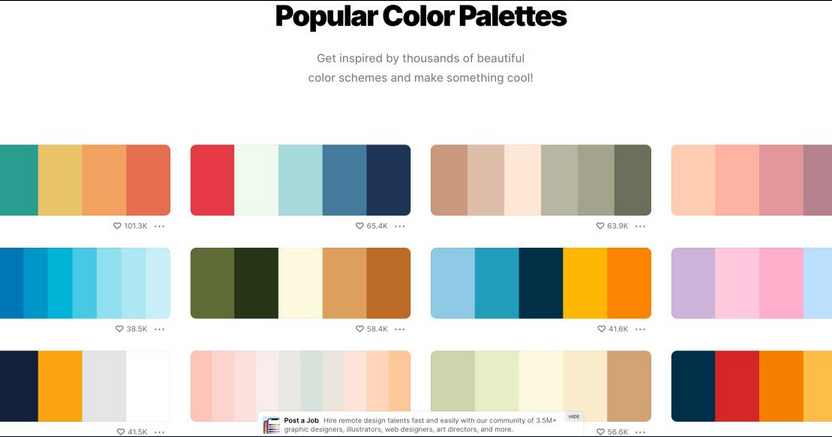

# Paleta-colores

<h1> Esquemas de colores para inspirarse. 🖍️🖌️🖊️🖋️</h1>

 

🎨 Los colores son muy importantes para comunicar una idea de negocio, además de conectar con nuestros clientes u objetivos. La importancia de ello versa sobre el cómo percibimos y cómo nos comportamos ante distintos colores, además de las emociones que ellos embargan sobre nosotros.
[Coolors](https://coolors.co/palettes/trending) alberga cientos de miles de paletas de colores en qué inspirarse. 💫

 
 
 

<h2># Pasos ✨🖌️</h2>

<h3>🖍️1. Busca tu paleta favorita. 😉</h3>

<h3>🖍️2. Haz clic sobre la paleta seleccionada. Automáticamente se copiará el código HEX. 😉</h3>

<h3>🖍️ 3. Pega tu código HEX en tu editor preferido. 😉</h3>

 
 

Bon apetite! 😋

 
 
 

**Lucho Ferrer 👨‍💻 - Asociación QGIS Perú** 
